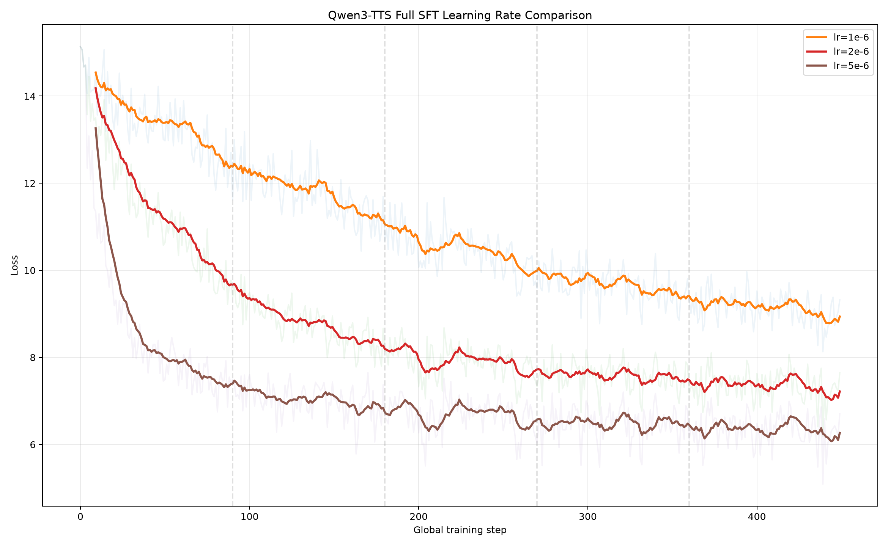
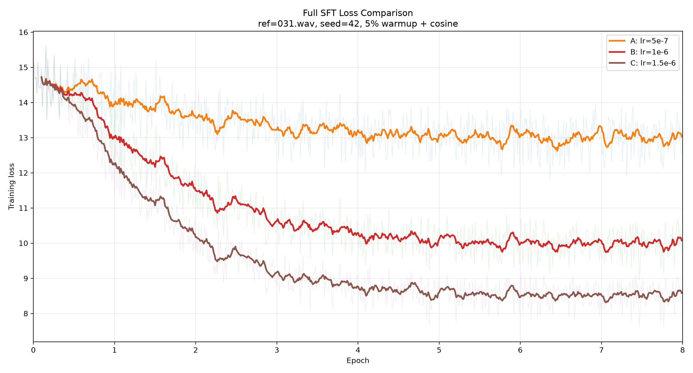
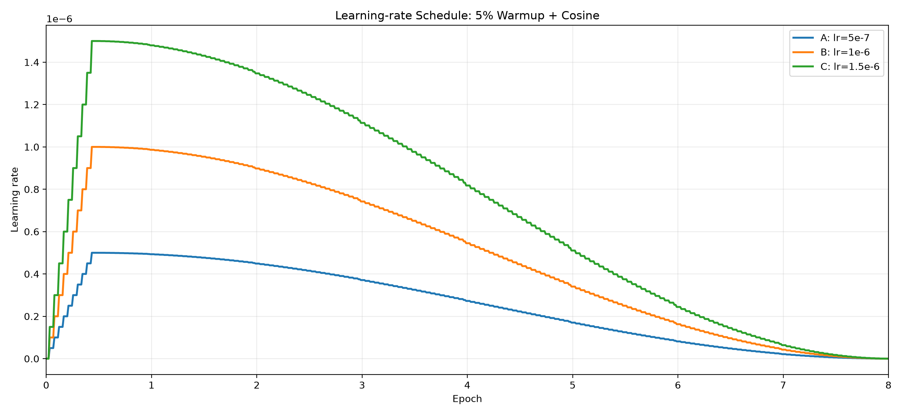

# Qwen3-TTS 全量 SFT：ref031 固定种子超参数实验

本目录整理了基于 `Qwen3-TTS-12Hz-1.7B-Base` 完成的两轮全量 SFT 实验结果。两轮实验均使用同一份 200 条语音数据、统一参考音频编号 `wavs/031.wav` 和随机种子 42，目的是比较不同学习率、训练轮数与学习率调度方式下，各个 epoch 的实际合成表现。

这里发布的是实验结果与复现材料，不是模型权重仓库。目录中包含成功实验的生成音频、训练日志、配置、loss 明细、图表、数据清单、运行脚本及环境记录；不包含 checkpoint、原始训练音频、参考音频文件、失败训练过程、PID 或缓存。

> **重要：loss 不是本实验的音频质量评价指标。** Loss 表和曲线只用于观察优化过程是否稳定、不同超参数下的收敛轨迹如何。最终效果应通过逐 epoch 主观听辨决定，重点包括说话人相似度、发音完整性、自然度、韵律和长文本是否被截断。本目录没有依据 loss 自动宣布“最佳模型”。

## 实验概要

共同设置：

| 项目 | 设置 |
|---|---|
| 基础模型 | `Qwen3-TTS-12Hz-1.7B-Base` |
| 微调方式 | 项目官方训练框架上的全量 SFT |
| 数据规模 | 200 条：180 条训练，20 条固定留出测试 |
| 统一参考音频 | `wavs/031.wav`，文件本身不在本目录 |
| 随机种子 | 42 |
| batch size | 2 |
| 梯度累积 | 4 |
| 有效 batch size | 8 |
| 每个 epoch 的 micro-batch | 90 |
| speaker name | `student_voice` |
| 精度 | BF16 |
| 注意力实现 | Flash Attention 2 |
| 单卡 | NVIDIA A800 80GB PCIe |

训练实现沿用项目的全量 SFT 路径。模型主体参数交给 AdamW 优化；speaker encoder 的输出按训练脚本执行 `detach()`，用于构建说话人条件与自定义说话人 embedding。

### 第一轮：5 epoch，固定学习率

第一轮用于建立学习率与逐 epoch 听感变化的基础对照：

| 实验 | 学习率 | 调度 | Epoch | 生成音频 |
|---|---:|---|---:|---:|
| R1-A | `1e-6` | 固定 | 5 | 115 |
| R1-B | `2e-6` | 固定 | 5 | 115 |
| R1-C | `5e-6` | 固定 | 5 | 115 |

每个实验、每个 epoch 生成 23 条音频：

- 3 条固定 compare 文本；
- 20 条固定留出测试文本。

第一轮共生成 `3 × 5 × 23 = 345` 条音频。

### 第二轮：8 epoch，5% warmup + cosine

第二轮在相同数据划分、参考音频与随机种子下，将学习率范围向较低区间移动，并增加训练轮数，观察较缓慢的优化轨迹：

| 实验 | 峰值学习率 | 调度 | Warmup | Epoch | 生成音频 |
|---|---:|---|---:|---:|---:|
| R2-A | `5e-7` | cosine | 5% | 8 | 184 |
| R2-B | `1e-6` | cosine | 5% | 8 | 184 |
| R2-C | `1.5e-6` | cosine | 5% | 8 | 184 |

8 个 epoch 对应约 184 次 optimizer update，warmup 使用前 10 次 update。每个 epoch 同样生成 3 条 compare 和 20 条 test。第二轮共生成 `3 × 8 × 23 = 552` 条音频。

两轮合计保存 **897 条生成音频**。

## Compare 文本

三个固定 compare 文本为：

| 标签 | 文本 |
|---|---|
| `seen_style` | 如果时间允许，我们下午一起去实验室继续完成模型训练。 |
| `unseen_short` | 这是使用我的个人语音数据微调后的测试语音。 |
| `unseen_long` | 人工智能语音合成技术正在快速发展，并逐渐应用到教育、医疗和智能交互等实际场景。 |

20 条 test 文本来自固定留出集，可在 [`data/test_texts.csv`](data/test_texts.csv) 中查看。

## Loss 表

下表是每个 epoch 内 90 个 micro-batch loss 的算术平均值。它描述训练轨迹，不代表听感排名。

| 轮次 | 学习率 | 调度 | Epoch 1 | Epoch 2 | Epoch 3 | Epoch 4 | Epoch 5 | Epoch 6 | Epoch 7 | Epoch 8 |
|---|---:|---|---:|---:|---:|---:|---:|---:|---:|---:|
| 5 epoch | `1e-6` | 固定 | 13.4189 | 11.7624 | 10.4742 | 9.6638 | 9.1367 | — | — | — |
| 5 epoch | `2e-6` | 固定 | 11.4952 | 8.7640 | 7.9158 | 7.5772 | 7.3460 | — | — | — |
| 5 epoch | `5e-6` | 固定 | 8.8137 | 7.0203 | 6.6870 | 6.4853 | 6.3477 | — | — | — |
| 8 epoch | `5e-7` | cosine | 14.4088 | 13.8552 | 13.4439 | 13.2178 | 13.0698 | 13.0226 | 13.0052 | 12.9967 |
| 8 epoch | `1e-6` | cosine | 14.0495 | 12.2163 | 11.0110 | 10.4390 | 10.1295 | 10.0324 | 9.9962 | 9.9881 |
| 8 epoch | `1.5e-6` | cosine | 13.6796 | 11.0872 | 9.5738 | 8.9260 | 8.6448 | 8.5593 | 8.5257 | 8.5235 |

完整数据：

- [`metrics/loss_steps.csv`](metrics/loss_steps.csv)：3510 条逐 micro-batch loss 记录；
- [`metrics/loss_epoch_summary.csv`](metrics/loss_epoch_summary.csv)：39 条逐 epoch 汇总，包含均值、标准差、最小值、最大值、首尾值；
- [`metrics/experiment_matrix.csv`](metrics/experiment_matrix.csv)：6 个实验的配置与音频数量；
- [`tools/summarize_losses.py`](tools/summarize_losses.py)：从发布后的训练日志重新生成 loss CSV。

### 第一轮 loss 曲线



### 第二轮 loss 曲线



### 第二轮学习率调度



曲线下降或 loss 数值更低，只能说明训练目标上的优化程度不同，不能单独推导合成音频更自然、更完整或更像目标说话人。

## 主观听辨建议

本目录保留了每个 epoch 的输出，建议以同一文本横向比较学习率、纵向比较 epoch：

1. 先听 `compare_audio` 中的 `seen_style`，判断常见表达的音色和稳定性；
2. 再听 `unseen_short`，判断短句发音、停顿与音色；
3. 听 `unseen_long`，检查长句完整度、韵律和是否提前结束；
4. 最后检查 `test20` 的 20 条固定文本，避免只根据三条 compare 做结论；
5. 记录主观偏好的实验与 epoch，再决定后续模型导出或复训设置。

音频文件中的 `epoch0` 对应训练的第 1 个 epoch，`epoch4` 对应第 5 个 epoch，`epoch7` 对应第 8 个 epoch。

## 目录结构

```text
.
├── README.md
├── data/
│   ├── metadata/                  # 原始实验清单，不含音频
│   ├── processed/                 # 含离散 audio codes 的训练 JSONL
│   ├── train_texts.csv            # 去除 AutoDL 绝对路径的便携文本清单
│   └── test_texts.csv
├── environment/
│   ├── round1_5epoch/
│   └── round2_8epoch_cosine/
├── experiments/
│   ├── round1_5epoch/
│   │   ├── lr1e-6/
│   │   ├── lr2e-6/
│   │   └── lr5e-6/
│   └── round2_8epoch_cosine/
│       ├── lr5e-7/
│       ├── lr1e-6/
│       └── lr1.5e-6/
├── figures/
├── metrics/
├── scripts/
└── tools/
```

每个成功实验目录包含：

```text
audio/
├── compare_audio/                 # 每个 epoch 的3条固定 compare
└── test20/
    ├── epoch0/                    # 20条测试音频和 metadata.tsv
    └── ...
train.log
config.original.txt
inference.log                      # 第一轮显式保存；第二轮推理输出合并在 train.log
*.sha256
```

`config.original.txt` 和原始 JSONL 中保留了当时 AutoDL 的绝对路径，用于溯源；跨机器复现时应改为本机路径。便携的文本与划分信息优先查看 `data/*_texts.csv`。

## 环境

两轮核心环境一致：

```text
Python 3.12.13
PyTorch 2.6.0+cu124
CUDA 12.4
Transformers 4.57.3
Accelerate 1.12.0
FlashAttention 2.8.3.post1
NVIDIA A800 80GB PCIe
```

完整依赖和 `nvidia-smi` 记录位于：

- [`environment/round1_5epoch`](environment/round1_5epoch)
- [`environment/round2_8epoch_cosine`](environment/round2_8epoch_cosine)

## 复现路径

原始数据和基础模型不随本目录重复发布。复现时需要自行准备：

1. Qwen3-TTS 项目及 `Qwen3-TTS-12Hz-1.7B-Base`；
2. 对应的 200 条音频数据；
3. 统一参考音频 `wavs/031.wav`；
4. 本目录 `data` 中的划分和文本，或重新运行数据准备脚本；
5. 与 `environment` 中一致的 Python/CUDA 环境。

第一轮脚本位于 [`scripts/round1_5epoch`](scripts/round1_5epoch)，第二轮脚本位于 [`scripts/round2_8epoch_cosine`](scripts/round2_8epoch_cosine)。这些脚本记录的是 AutoDL 实验实现，运行前需要修改模型、数据和输出路径。

为了节省空间，实验过程采用“每个 epoch 推理后验证数量，再删除 checkpoint”的流程：

- 单个 epoch 必须生成 3 条 compare 和 20 条 test；
- 验证为 23 条后才删除对应 checkpoint；
- 因此本发布目录无法直接恢复模型权重，只能用于结果听辨、训练轨迹分析与实验复现。

## 未包含内容

本目录刻意排除了：

- 所有 checkpoint 和模型权重；
- 原始训练音频、留出测试原音频和 `wavs/031.wav`；
- 两次脚本调试失败记录和算力中断日志；
- PID、`__pycache__`、临时文件及重复压缩包；
- 其他人已经发布的数据副本。

参考音频与训练清单的 SHA-256 记录仍保留在各实验目录中，用于确认不同实验确实使用了同一输入版本。
