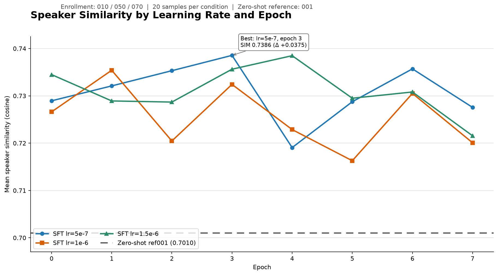

# 自动化 SIM 说话人相似度评测

本目录用于比较 Qwen3-TTS 的 **zero-shot 基线**与不同学习率、不同 epoch 的 **SFT 微调模型**输出。评测只读取已经生成的 WAV 音频，不修改模型或训练代码。

当前评测使用 ERes2NetV2 提取说话人向量，再计算余弦相似度（SIM）。**SIM 越高，表示合成音频的音色越接近 enrollment 真人录音。**

## 1. 当前评测配置

| 项目 | 当前配置 |
| --- | --- |
| 说话人验证模型 | `iic/speech_eres2netv2_sv_zh-cn_16k-common` |
| Enrollment | `010.wav`、`050.wav`、`070.wav` |
| Zero-shot 参考音频 | `001.wav` |
| SFT 参考音频 | `031.wav`（由 SFT 运行目录名确定） |
| 测试音频 | `test_010.wav` ～ `test_200.wav`，每隔 10 取一条 |
| 每个条件的样本数 | 20 |
| 学习率 | `5e-7`、`1e-6`、`1.5e-6` |
| Epoch | `0` ～ `7` |
| SFT 条件总数 | 3 个学习率 × 8 个 epoch = 24 组 |
| 运行设备 | `cuda:0` |

本 README 中的结果和结论只对应上表所列的当前配置。

## 2. 数据目录与文件约定

```text
evaluation/
├─ data/
│  ├─ enrollment/
│  │  ├─ 010.wav
│  │  ├─ 050.wav
│  │  └─ 070.wav
│  └─ generated/
│     └─ zero_shot/
│        ├─ test_010.wav
│        ├─ test_020.wav
│        ├─ ...
│        └─ test_200.wav
├─ hparam_sim.py
├─ run_hparam_sim.py
└─ results/
   └─ Best/
      ├─ hparam_summary.csv
      ├─ hparam_sample_scores.csv
      ├─ hparam_pair_scores.csv
      ├─ sim_by_epoch_learning_rate.png
      ├─ hparam_sim_enroll_010_050_070.xlsx
      └─ run_metadata.json
```

SFT 超参数目录位于当前实验的 `hparam_runs/` 下，结构如下：

```text
hparam_runs/
├─ A_lr5e-7_cosine8_ref031_seed42/
├─ B_lr1e-6_cosine8_ref031_seed42/
└─ C_lr1.5e-6_cosine8_ref031_seed42/
   └─ results/
      └─ test20/
         ├─ epoch0/
         ├─ epoch1/
         ├─ ...
         └─ epoch7/
            ├─ test_010.wav
            ├─ test_020.wav
            ├─ ...
            └─ test_200.wav
```

每个 SFT 条件和 zero-shot 文件夹都必须包含相同的 20 个样本 ID。相同 ID（例如 `test_050.wav`）必须由相同测试文本生成，否则逐条比较没有意义。

## 3. SIM 评分原理

对每条合成音频，流程会提取一个 ERes2NetV2 说话人向量，并分别与三条 enrollment 录音计算余弦相似度。

```text
配对级 SIM = cosine(合成音频向量, 一条 enrollment 向量)

一条合成音频 × 3 条 enrollment = 3 个配对级 SIM

样本级 SIM = 该合成音频的 3 个配对级 SIM 的平均值

条件级 SIM = 一个条件下 20 个样本级 SIM 的平均值
```

最终比较的是每个 SFT 学习率/epoch 条件的平均 SIM 与固定 zero-shot 平均 SIM：

```text
delta = SFT mean SIM - zero-shot mean SIM
```

`delta > 0` 表示当前 SFT 条件的平均说话人相似度高于 zero-shot。

## 4. `results/Best` 最佳结果

### 4.1 最佳条件

24 个 SFT 条件中，平均 SIM 最高的是：

| 项目 | 结果 |
| --- | ---: |
| 最佳学习率 | `5e-7` |
| 最佳 epoch | `3` |
| Zero-shot mean SIM（ref `001.wav`） | `0.701030` |
| Best SFT mean SIM（ref `031.wav`） | `0.738553` |
| 绝对提升（SFT − zero-shot） | **`+0.037523`** |

在当前固定配置下，最佳 SFT 的平均 SIM 从 zero-shot 的 `0.701030` 提高到 `0.738553`。三个学习率的 24 个 SFT 条件均高于固定 zero-shot 基线，其中学习率 `5e-7`、epoch `3` 得分最高。

### 4.2 各学习率的最佳 epoch

| 学习率 | 最佳 epoch | SFT mean SIM | 相对 zero-shot 提升 |
| --- | ---: | ---: | ---: |
| `5e-7` | 3 | `0.738553` | `+0.037523` |
| `1e-6` | 1 | `0.735406` | `+0.034376` |
| `1.5e-6` | 4 | `0.738487` | `+0.037457` |

`5e-7 / epoch 3` 与 `1.5e-6 / epoch 4` 的结果非常接近，但前者仍是当前 24 组中最高的一组。曲线也说明 SIM 不会随着 epoch 单调上升，因此不能只选择最后一个 checkpoint，需要逐 epoch 评测。

### 4.3 学习率与 epoch 曲线



图中三条实线分别代表三个学习率在 epoch 0～7 的 SFT mean SIM，水平线代表固定的 zero-shot mean SIM。图表对应的原始数值来自 [`hparam_summary.csv`](results/Best/hparam_summary.csv)。

### 4.4 `Best` 文件说明

- [`hparam_summary.csv`](results/Best/hparam_summary.csv)：24 个学习率/epoch 条件的汇总结果，按学习率和 epoch 排列；包含 zero-shot mean、SFT mean、delta、标准差、最小值和最大值。
- [`hparam_sample_scores.csv`](results/Best/hparam_sample_scores.csv)：480 行条件/样本结果（24 个条件 × 20 条音频），用于定位某个 epoch 中表现较好或较差的具体样本。
- [`hparam_pair_scores.csv`](results/Best/hparam_pair_scores.csv)：1,500 个原始“合成音频—enrollment”配对分数，包括 60 个 zero-shot 配对和 1,440 个 SFT 配对。
- [`sim_by_epoch_learning_rate.png`](results/Best/sim_by_epoch_learning_rate.png)：三个学习率随 epoch 变化的 SFT mean SIM，以及固定 zero-shot 基线。
- [`hparam_sim_enroll_010_050_070.xlsx`](results/Best/hparam_sim_enroll_010_050_070.xlsx)：整理后的 Excel 报告，包含 `Summary`、`Sample Scores`、`Pair Scores` 和 `Method` 工作表以及原生折线图。
- [`run_metadata.json`](results/Best/run_metadata.json)：记录 hparam 路径、模型目录、参考音频、enrollment、样本数、聚合方式和运行设备，用于复现实验。

阅读结果时建议先看 Excel 或折线图了解总体趋势，再通过 sample CSV 定位具体音频，最后在需要核查某条 enrollment 配对时查看 pair CSV。

## 5. 安装依赖

在能够运行 Qwen3-TTS 的 Conda 环境中执行：

```powershell
conda activate qwen3-tts
python -m pip install -r evaluation/requirements.txt
```

评测使用本地 ERes2NetV2 模型目录，因此不会在每次运行时重新下载模型。当前模型目录为：

```text
D:\modelscope-cache\models\iic--speech_eres2netv2_sv_zh-cn_16k-common\snapshots\master
```

## 6. 检查 24 组数据

在 `sim_evaluation` 目录执行 dry-run：

```powershell
python evaluation/run_hparam_sim.py `
  --hparam-root "C:\Users\26686\Desktop\ref031_cosine_8ep_seed42_20260730\ref031_cosine_8ep_seed42_20260730\hparam_runs" `
  --enrollment-dir evaluation/data/enrollment `
  --zero-shot-dir evaluation/data/generated/zero_shot `
  --output-dir evaluation/results/Best `
  --local-model-path "D:\modelscope-cache\models\iic--speech_eres2netv2_sv_zh-cn_16k-common\snapshots\master" `
  --device cuda:0 `
  --dry-run
```

验证通过时应显示：

```text
enrollment：3 条（010/050/070）
zero-shot：20 条（test_010～test_200）
SFT 候选：24 组，每组 20 条
```

dry-run 只检查目录、样本 ID 和条件数量，不加载模型，也不覆盖结果。

## 7. 重新运行完整评测

确认 dry-run 通过后，移除 `--dry-run`：

```powershell
python evaluation/run_hparam_sim.py `
  --hparam-root "C:\Users\26686\Desktop\ref031_cosine_8ep_seed42_20260730\ref031_cosine_8ep_seed42_20260730\hparam_runs" `
  --enrollment-dir evaluation/data/enrollment `
  --zero-shot-dir evaluation/data/generated/zero_shot `
  --output-dir evaluation/results/Best `
  --local-model-path "D:\modelscope-cache\models\iic--speech_eres2netv2_sv_zh-cn_16k-common\snapshots\master" `
  --device cuda:0
```

程序会在一个进程中缓存每段音频的说话人向量，计算 24 个 SFT 条件，并重新生成三个 CSV 和 `run_metadata.json`。

如需更新折线图，在项目根目录执行：

```powershell
python sim_evaluation/evaluation/build_hparam_report.py `
  --summary sim_evaluation/evaluation/results/Best/hparam_summary.csv `
  --output sim_evaluation/evaluation/results/Best/sim_by_epoch_learning_rate.png
```

## 8. 结果解释注意事项

- SIM 只衡量说话人音色相似度，不能反映文本正确率、漏字、截断、停顿自然度或主观听感。
- 判断模型是否真正改善时，还应结合 CER/WER、音频完整性检查和人工主观评价。
- 本 README 中的最佳参数只针对当前 enrollment、参考音频、20 条测试文本和 ERes2NetV2 评分配置；更换其中任何一项后都应重新评测。
