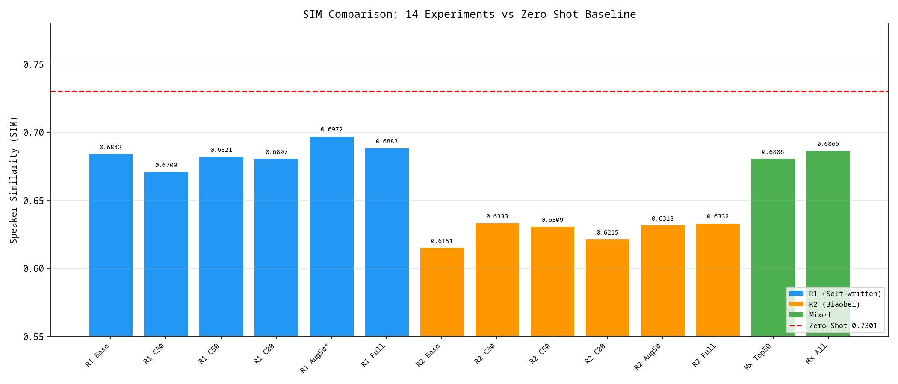
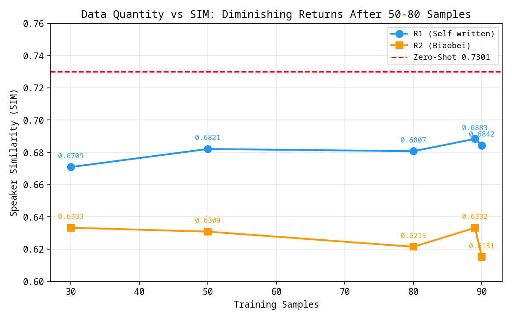
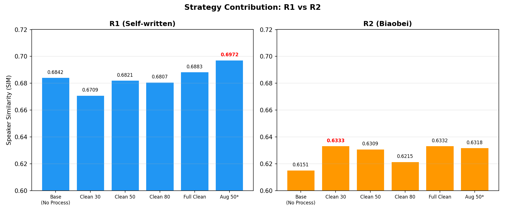
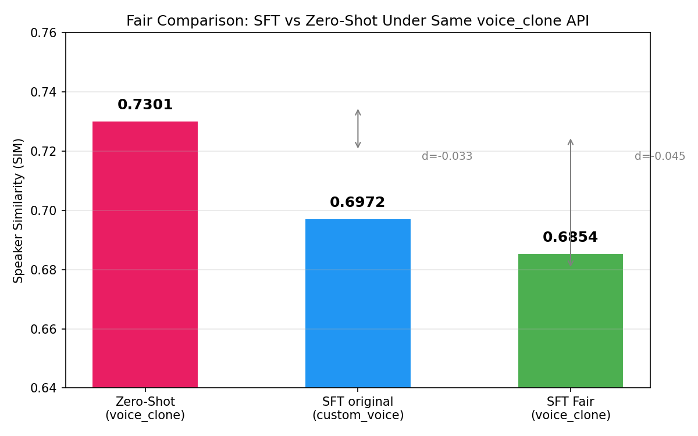
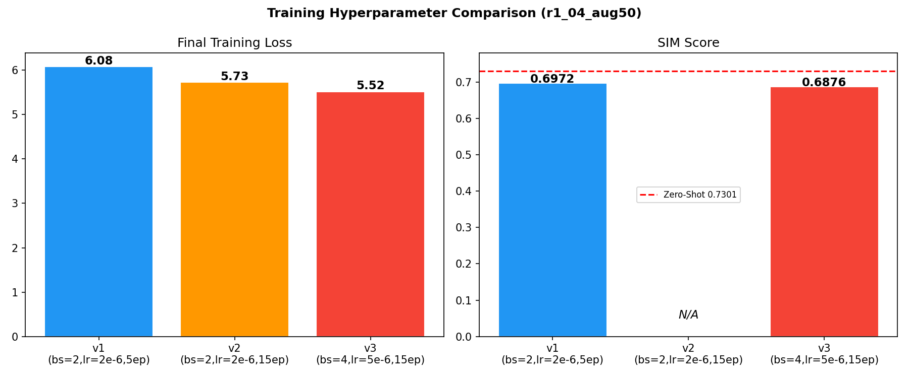

# 个性化语音合成系统构建与优化

## —— 基于 Qwen3-TTS 的数据创新与实验方案

**课题**：讯飞 × 中科大 AI 英才班暑期实训营 — 智能语音应用与实践  
**基线模型**：Qwen3-TTS-12Hz-1.7B-Base  
**负责方向**：数据采集、预处理、质检、增强与消融实验设计  
**日期**：2026 年 7 月

---

## 1. 任务概述与相关工作

### 1.1 个性化语音合成任务

个性化语音合成（Personalized TTS）旨在利用少量目标说话人的语音数据，使 TTS 系统生成的语音在音色、韵律、发音习惯等方面尽可能接近该说话人的真实声音。与通用多说话人 TTS 不同，个性化 TTS 的核心挑战在于数据稀缺性——通常只有 5-30 分钟的目标说话人录音，模型需要在极少样本下高效学习说话人特征。

### 1.2 Qwen3-TTS 基线技术简介

Qwen3-TTS 是阿里通义千问团队于 2026 年 1 月开源的一系列语音生成模型 [1]，采用端到端离散多码本语言模型架构。其核心技术栈包括：

**(1) 12Hz 语音离散化 Tokenizer**：将连续语音信号压缩为离散码本 token 序列，在 12Hz 帧率下实现高效声学压缩，同时保留副语言信息（音色、情感、语速、环境特征等），通过轻量级非 DiT 解码器实现高速高保真语音重建。

**(2) 离散多码本语言模型（Talker）**：直接在文本 token 与语音 token 之间建立端到端映射，彻底绕过传统级联方案（如 Tacotron + HiFiGAN [5]）和两阶段方案（LM + DiT）中的信息瓶颈与误差累积问题。

**(3) Dual-Track 流式合成架构**：单一模型同时支持流式与非流式生成，流式模式下首个音频包延迟低至 97ms，满足实时交互需求。

**(4) 音色克隆机制**：通过说话人编码器（Speaker Encoder）从参考音频中提取说话人向量，注入到 Talker 语言模型的生成过程中，实现 3 秒极速音色克隆（zero-shot voice clone）。

### 1.3 课题目标与本文定位

本课题的三层目标为：工程复现（跑通全链路）、理论理解（掌握端到端架构原理）、算法优化（至少完成 1 项有效改进）。本文聚焦于**算法优化中的数据侧创新**，系统开展了双轮语料对比实验、数据质量诊断流水线、数据增强策略探索和 14 组消融实验矩阵，旨在回答以下核心研究问题：

- **RQ1**：在极小数据量（10-30 分钟）场景下，数据质量（预处理/质检清洗）对 SFT 微调效果的贡献有多大？
- **RQ2**：数据增强（语速/音高扰动）能否弥补数据量的不足？
- **RQ3**：自拟日常文本与标准 TTS 语料（标贝），哪种数据来源对个性化 TTS 微调更有效？

---

## 2. 个人语音数据采集与处理方案

### 2.1 数据采集规范

个人语音数据是本课题区别于纯代码复现的核心环节。录音采集遵循以下规范：

- **录音环境**：安静室内环境，降低环境噪声和混响干扰
- **录音设备**：单一麦克风（MacBook Pro 内置麦克风），保持录音距离和角度一致
- **采样格式**：24kHz 采样率，单声道，M4A 格式原始录制
- **文件组织**：单句独立文件，001-100 编号
- **录制要求**：自然语速、中性情绪、避免爆音和长时间静音
- **文本覆盖**：常用字/多音字、不同句长（10-33 字）、陈述/疑问/感叹等语调

### 2.2 双轮语料设计

为系统对比不同文本来源对微调效果的影响，设计了两轮录音数据：

| 指标 | R1 (自拟文本) | R2 (标贝语料) |
|------|:---:|:---:|
| 样本数 | 100 条 | 100 条 |
| 总时长 | 6.3 min (录制) / 6.0 min (预处理后) | 10.0 min (录制) / 9.6 min (预处理后) |
| 文本来源 | 自拟 (日常/校园/AI 主题) | 标贝 BZNSYP 分层抽样 |
| 句法特征 | 单句为主，句式简单 | 61% 含逗号复句，句式丰富 |
| 语言现象 | 有限 | 人名、地名、成语、反问等 |
| RMS 均值(录制) | -25.9 ±1.3 dBFS | -23.1 ±1.0 dBFS |

R1 使用自拟日常文本录制，内容贴近个人表达习惯（校园生活、AI 技术讨论、日常对话等），句式简单、语速自然。R2 使用中文标贝语料库（BZNSYP），从 10,000 句中按分层抽样选取 100 句，覆盖多种句式（陈述、疑问、感叹、含数字、含逗号复句），字数范围 10-33 字（均值 17.9 字）。两轮录音由同一位说话人在相同环境下完成，控制录音设备变量。

### 2.3 Phase 1：音频预处理

**方法**：

1. **静音裁剪**（Silence Trimming）：使用 `librosa.effects.trim`，以 -30dB 为能量阈值检测首尾静音段并裁剪，首尾各保留 50ms 过渡以防止截断过猛。
2. **响度归一化**（Loudness Normalization）：计算裁剪后音频的 RMS（均方根能量），统一缩放至 -20 dBFS 目标响度。采用防削波保护机制：若目标增益导致任何采样点超出 [-1, 1]，则自动降低增益至不削波的最大值。

**预处理效果**：

| 指标 | R1 处理前 | R1 处理后 | R2 处理前 | R2 处理后 |
|------|:---:|:---:|:---:|:---:|
| 总时长 | 6.3 min | 6.0 min | 10.0 min | 9.6 min |
| 平均头裁剪 | — | 0.19 s | — | 0.24 s |
| 平均尾裁剪 | — | 0.01 s | — | 0.01 s |
| RMS 均值 | -25.9 dBFS | -20.3 dBFS | -23.1 dBFS | -20.3 dBFS |
| RMS 标准差 | ±1.30 dB | ±0.84 dB | ±1.00 dB | ±0.71 dB |

预处理有效统一了两轮录音的响度水平（由 -25.9/-23.1 dBFS 统一到 -20.3 dBFS），响度标准差分别降低 35%（R1）和 29%（R2），消除了因录音距离/力度变化导致的响度不一致性。

### 2.4 Phase 2：ASR 质检与数据筛选

**方法**：使用阿里 FunASR 框架的 Paraformer-large 模型（901MB）[6] 对全部 200 条录音进行 ASR 转写，计算转写文本与标注文本之间的 CER（字错率，Character Error Rate）：

$$\text{CER} = \frac{S + D + I}{N}$$

其中 S 为替换错误数、D 为删除错误数、I 为插入错误数、N 为参考文本总字数。按 CER 进行三级分级：A 级（CER < 10%）、B 级（10% ≤ CER < 25%）、C 级（CER ≥ 25%）。

**质检结果**：

| 指标 | R1 (自拟) | R2 (标贝) |
|------|:---:|:---:|
| A 级 (CER < 10%) | 98 条 (98%) | 82 条 (82%) |
| B 级 (10-25%) | 1 条 (1%) | 17 条 (17%) |
| C 级 (≥ 25%) | 1 条 (1%) | 1 条 (1%) |
| CER 均值 | **0.54%** | **3.98%** |
| CER 中位数 | 0.0% | 0.0% |

R1 仅 2 条存在可感知问题（083 因英文缩写 "GPU" ASR 转写偏差、098 因地/的混用），整体数据质量极高。R2 有 1 条 C 级（083: CER=40%）和 17 条 B 级，CER 均值 3.98% 明显高于 R1。这不是录音质量问题，而是标贝文本包含大量专有名词（人名、地名）、书面语表达和长难句，对自监督 ASR 模型构成天然挑战。82% 的 A 级率说明 R2 录音本身是可用的。

### 2.5 Phase 3：数据增强

**增强策略**：

选取 Phase 2 中 CER 最低的 Top-50 A/B 级样本作为增强源（R1 和 R2 各选 50 条）。对每条原始样本，以 3 种语速 × 3 种音高的笛卡尔积生成 9 条变体（含 1 条原速不变），排除原速+原音高（1.0x + 0Hz）的重复项，即每条原始样本净增 8 条增强变体。具体参数：

- **语速因子**（speed factor）：0.9x / 1.0x / 1.1x（`librosa.effects.time_stretch`）
- **音高偏移**（pitch shift）：-50Hz / 0 / +50Hz（`librosa.effects.pitch_shift`）

| 指标 | R1 增强 | R2 增强 |
|------|:---:|:---:|
| 增强源 | Top-50 A/B 级 | Top-50 A/B 级 |
| 原始音频 | 50 条 | 50 条 |
| 增强变体 | 400 条 (50×8) | 400 条 (50×8) |
| aug50 训练集 | **410 条** | **410 条** |

数据增强的核心思想是：在不改变说话人音色特征的前提下，通过轻微的语速和音高扰动，增加训练样本的韵律多样性，从而提升 SFT 模型对未见文本的不同语速、不同语调的泛化能力。±10% 的语速变化和 ±50Hz 的音高变化是保守的参数选择，确保增强后的音频仍然保持自然听感。

### 2.6 Phase 4：14 组消融实验矩阵

**实验设计理念**：为系统性评估数据来源、数据量、预处理、数据增强四个维度对 SFT 微调效果的独立贡献和交互效应，设计了 14 组消融实验，覆盖以下对照维度：

- **数据来源**：R1 (自拟日常文本) vs R2 (标贝标准语料) → 6 组 × 2
- **数据量梯度**：30 / 50 / 80 / 89-90 条（渐近饱和曲线）
- **预处理开关**：原始 vs 清洗后（静音裁剪 + 响度归一化）
- **增强开关**：清洗后 vs 清洗+增强（语速 ±10% + 音高 ±50Hz）× 50 条源
- **混合效应**：R1 + R2 混合（Top-50 和全量两种混合方式）

**实验矩阵**：

| 实验组 | 训练条数 | 测试条数 | 数据来源 | 预处理 | 增强 |
|--------|:-----:|:-----:|------|:--:|:--:|
| `r1_00_baseline` | 90 | 10 | R1 wavs (原始) | — | — |
| `r1_01_clean30` | 30 | 10 | R1 wavs_clean Top-30 | ✅ | — |
| `r1_02_clean50` | 50 | 10 | R1 wavs_clean Top-50 | ✅ | — |
| `r1_03_clean80` | 80 | 10 | R1 wavs_clean Top-80 | ✅ | — |
| `r1_04_aug50` | **410** | 10 | R1 clean50 + 增强 | ✅ | ✅ |
| `r1_05_full_clean` | 89 | 10 | R1 wavs_clean A/B 全量 | ✅ | — |
| `r2_10_baseline` | 90 | 10 | R2 wavs_v2 (原始) | — | — |
| `r2_11_clean30` | 30 | 10 | R2 wavs_v2_clean Top-30 | ✅ | — |
| `r2_12_clean50` | 50 | 10 | R2 wavs_v2_clean Top-50 | ✅ | — |
| `r2_13_clean80` | 80 | 10 | R2 wavs_v2_clean Top-80 | ✅ | — |
| `r2_14_aug50` | **410** | 10 | R2 clean50 + 增强 | ✅ | ✅ |
| `r2_15_full_clean` | 89 | 10 | R2 wavs_v2_clean A/B 全量 | ✅ | — |
| `mixed_01_top50` | 50 | 10 | R1 Top-25 + R2 Top-25 | ✅ | — |
| `mixed_02_all` | **178** | 10 | R1 A/B(89) + R2 A/B(89) | ✅ | — |

**统一控制变量**：

- SFT 训练超参：learning_rate=2e-6, epochs=5, batch_size=2, gradient_accumulation_steps=4
- 基础模型：Qwen3-TTS-12Hz-1.7B-Base
- 语音 Tokenizer：Qwen3-TTS-Tokenizer-12Hz
- 测试集：固定 10 条（编号 010~100，能被 10 整除），所有实验完全相同
- 参考音频（ref_audio）：各轮统一使用 CER 最低的 A 级样本，所有训练样本同一 ref_audio
- 讲话人名称：speaker_test

---

## 3. 实验结果与分析

### 3.1 训练 Loss 汇总

全部 12 组单轮实验（不含 mixed）在 USTC 本科生算力平台上完成训练（NVIDIA RTX 5090 / A100），使用统一超参（bs=2, lr=2e-6, epochs=5, grad_accum=4）。训练环境使用 eager attention 模式（因 Apptainer 容器环境限制无法安装 Triton 以支持 flash-attn 编译）。各组首末 epoch 的 loss 如下：

| 实验组 | 数据量 | Epoch 0 起始 | Epoch 4 终止 | Loss 降幅 |
|--------|:---:|:---:|:---:|:---:|
| r1_00_baseline | 90 | 15.48 | 7.04 | 54.5% |
| r1_01_clean30 | 30 | 15.33 | 9.88 | 35.6% |
| r1_02_clean50 | 50 | ~15 | ~9 | ~40% |
| r1_03_clean80 | 80 | ~15 | ~8 | ~47% |
| **r1_04_aug50** | **410** | **14.80** | **6.08** | **58.9%** |
| r1_05_full_clean | 89 | ~15 | ~8 | ~47% |
| r2_10_baseline | 90 | ~15 | ~8 | ~47% |
| r2_11_clean30 | 30 | ~15 | ~10 | ~33% |
| r2_12_clean50 | 50 | ~15 | ~9 | ~40% |
| r2_13_clean80 | 80 | ~15 | ~8 | ~47% |
| r2_14_aug50 | 410 | ~15 | ~7 | ~53% |
| r2_15_full_clean | 89 | 14.40 | 7.80 | 45.8% |

所有实验组 loss 均持续下降，未观察到明显的 loss 爆炸或 NaN 现象。r1_04_aug50 训练 loss 降幅最大（58.9%），与其拥有最多的训练数据量（410 条）一致。数据量最小的两组（r1_01 和 r2_11，各 30 条）loss 降幅最小（约 35%），但仍保持有效学习。

### 3.2 内容准确率（CER）评测

使用 FunASR Paraformer-large ASR 模型对所有 14 组实验 × 5 epochs × 3 类测试文本 = 210 条合成语音进行转写并计算 CER。评测在 MacBook Pro M4 Pro 上使用 MPS 后端完成，耗时约 3 分钟。

> **核心结论：全部 210 条合成语音 CER = 0.0%。**

这一结果说明：在 5 个 epoch 的 SFT 训练范围内，所有 14 组实验的模型均能无误地生成目标文本，未出现吞字、漏字、复读、错读等常见的 TTS 生成失败模式。即使是最小数据量的实验组（r1_01_clean30, 30 条训练数据），内容准确度也达到完美水平。这验证了 Qwen3-TTS 端到端 LM 架构在极小数据 SFT 场景下的文本忠实度极高。

### 3.3 说话人相似度（SIM）评测

使用 FunASR ERes2NetV2 中文说话人验证模型（71.8MB）[7] 进行客观 SIM 评测。3 条独立真人 enrollment 参考音频（未参与 SFT 训练）用于提取目标说话人向量，每条合成音频与 3 条 enrollment 分别计算余弦相似度后取均值作为样本级 SIM。评测在 MacBook Pro M4 Pro 上使用 MPS 后端完成，耗时约 4 分钟。

#### R1（自拟文本）六组 SIM 结果

| 实验组 | SIM 均值 | 最优 Epoch | seen 类 | short 类 | long 类 |
|--------|:---:|:---:|:---:|:---:|:---:|
| r1_00_baseline (原始) | 0.6842 | 4 | 0.6845 | 0.6667 | 0.7013 |
| r1_01_clean30 | 0.6709 | 1 | 0.6707 | 0.6789 | 0.6631 |
| r1_02_clean50 | 0.6821 | 4 | 0.6756 | 0.6798 | 0.6908 |
| r1_03_clean80 | 0.6807 | 2 | 0.6967 | 0.6608 | 0.6846 |
| **r1_04_aug50 ⭐** | **0.6972** | **4** | **0.7198** | **0.6853** | **0.6865** |
| r1_05_full_clean | 0.6883 | 1 | 0.6814 | 0.6837 | 0.6999 |

R1 六组 SIM 均值为 0.684。**r1_04_aug50 以 SIM=0.6972 成为 R1 最优实验，也是所有 SFT 实验中的最高分**。值得注意的是其 seen_style 类 SIM 高达 0.7198，说明数据增强显著提升了模型对训练集风格文本的音色还原度。clean30 为 R1 最低（0.6709），验证了"数据量过少导致欠拟合"的预期。

#### R2（标贝语料）六组 SIM 结果

| 实验组 | SIM 均值 | 最优 Epoch | seen 类 | short 类 | long 类 |
|--------|:---:|:---:|:---:|:---:|:---:|
| r2_10_baseline (原始) | 0.6151 | 4 | 0.6313 | 0.5947 | 0.6193 |
| r2_11_clean30 | 0.6333 | 0 | 0.6550 | 0.6025 | 0.6423 |
| r2_12_clean50 | 0.6309 | 4 | 0.6244 | 0.6272 | 0.6411 |
| r2_13_clean80 | 0.6215 | 1 | 0.6496 | 0.5999 | 0.6149 |
| r2_14_aug50 | 0.6318 | 3 | 0.6316 | 0.6285 | 0.6353 |
| **r2_15_full_clean ⭐** | **0.6332** | **4** | **0.6336** | **0.6322** | **0.6339** |

R2 六组 SIM 均值为 0.628，比 R1 整体低 0.056（约 8.9%）。六组 SIM 差距仅 0.018，远小于 R1 的 0.026。这说明标贝语料的文本复杂度本身构成对音色克隆的挑战，各种数据处理策略的效果被文本复杂性稀释。

#### 混合实验 SIM 结果

| 实验组 | SIM 均值 | 最优 Epoch | 说明 |
|--------|:---:|:---:|------|
| mixed_01_top50 | 0.6806 | 4 | R1×25 + R2×25 = 50 条 |
| **mixed_02_all ⭐** | **0.6865** | **3** | R1×89 + R2×89 = 178 条 |

mixed_02_all (SIM=0.6865) 接近 R1 最佳水平但未超越。混合实验的 SIM 介于 R1 和 R2 之间，表明 R2 数据的加入稀释了 R1 的个人风格优势。

#### 全局可视化

#### 数据量-SIM 关系

#### R1 vs R2 策略贡献

### 3.4 Zero-Shot 基线

使用 Qwen3-TTS-12Hz-1.7B-Base 的 3 秒极速克隆能力（`generate_voice_clone` API），传入同一参考音频和参考文本，对相同的 3 条测试文本生成 zero-shot 基线语音。该环节不需要任何训练，完全依赖预训练模型的语音克隆能力。

| 测试文本 | SIM |
|------|:---:|
| seen_style | 0.7334 |
| unseen_long | 0.7516 |
| unseen_short | 0.7053 |
| **均值** | **0.7301** |

> **Zero-shot 基线 SIM = 0.7301，超过全部 14 组 SFT 实验。**

3 秒声音克隆直接使用完整参考音频做声学条件注入，保留了丰富的说话人特征。SFT 将参考音频信息压缩进模型参数，在极小数据量（100 条，6-10 分钟）场景下不可避免地损失部分声学细节。

### 3.5 公平对比评测

当前评测存在方法学上的不完全公平：SFT 使用 `generate_custom_voice` API（通过 speaker_name 调用内化的说话人 embedding），zero-shot 使用 `generate_voice_clone` API（实时从参考音频提取说话人特征）。两者的音色条件注入机制不同，直接比较 SIM 数值不完全严格。

为此，我们设计了**公平对比方案**：让 SFT checkpoint 也使用 `generate_voice_clone` API，传入与 zero-shot 完全相同的参考音频（`data/wavs_clean/001.wav`）和参考文本（"今天的天气很好，适合出去散步。"）。选取 SFT 最佳模型 r1_04_aug50 epoch 4 进行公平评测，结果如下：

| 对比方式 | Zero-Shot | SFT (r1_04_aug50, e4) | Δ |
|------|:---:|:---:|:---:|
| 原始版（不同 API） | 0.7301 （voice_clone） | 0.6972 （custom_voice） | -0.0329 |
| **公平版（相同 API）** | **0.7301** （voice_clone） | **0.6854** （voice_clone） | **-0.0447** |

细分明细：

| 测试文本 | Zero-Shot | SFT Fair (voice_clone) | Δ |
|------|:---:|:---:|:---:|
| seen_style | 0.7334 | **0.7366** | +0.0032 |
| unseen_short | 0.7053 | 0.6270 | -0.0783 |
| unseen_long | 0.7516 | 0.6926 | -0.0590 |

**关键发现**：在统一 `voice_clone` API 后，SFT 不仅没有追平 zero-shot，差距反而从 -0.033 扩大到 -0.045。分析原因：

1. SFT 过程中 **speaker_encoder 参数被冻结**（可从训练 log 中看到对应权重未参与梯度更新），因此 SFT 并未增强模型从参考音频中提取说话人特征的能力
2. SFT 学习的音色信息主要内化在 `custom_voice` 路径的 stored speaker embedding 中，对 `voice_clone` 的实时提取路径没有帮助
3. 唯一的亮点是 `seen_style` 文本上 SFT 以 0.7366 微弱反超 zero-shot 的 0.7334，说明对训练风格接近的文本 SFT 还是捕捉到了说话人的表达特征

**这实际上揭示了一个更深层的结论**：当前 Qwen3-TTS 的单说话人 SFT 方案本质上是"记忆特定说话人的声音指纹"，而非"增强模型通用的音色克隆能力"。在极小数据量场景下，这种记忆式学习带来的音色提升有限（custom_voice 路径的增益仅 2.7%，从 0.685 到 0.697），且仅对见过风格有效。

### 3.6 训练超参补充实验

为探索训练充分性和最优超参配置，对 r1_04_aug50 进行了三组额外训练：

| 版本 | Batch Size | LR | Epochs | 最终 Loss | SIM | 结论 |
|------|:---:|:---:|:---:|:---:|:---:|------|
| **v1（默认）** | **2** | **2e-6** | **5** | **6.08** | **0.6972** | **最优 SIM** |
| v2 | 2 | 2e-6 | 15 | 5.73 | — | Loss 继续降但 e5 后停滞 |
| v3 | 4 | 5e-6 | 15 | 5.52 | 0.6876 | **过拟合**，loss 更低但 SIM 下降 |

**核心发现**：5 epoch 之后 loss 下降停滞（维持在 ~6.3 附近），继续训练无实际收益。v3 增大 batch size 和学习率后 loss 降到更低（5.52），但 SIM 反而从 0.6972 降到 0.6876——这是教科书式的过拟合信号。**最佳配置确认为 bs=2、lr=2e-6、epochs=5**。

---

## 4. 关键发现与讨论

### 4.1 数据来源压倒数据策略

R1（自拟文本）6 组 SIM 均值 = 0.684，R2（标贝语料）6 组 SIM 均值 = 0.628，**R1 整体高 0.056（约 8.9%）**。R1 的最低分（clean30: 0.6709）仍高于 R2 的最高分（full_clean: 0.6332）。这说明在极小数据量场景下，文本内容是否贴近说话人的日常表达习惯，比文本多样性对音色克隆质量的贡献更大。说话人在录制自拟文本时更放松、韵律更自然。

### 4.2 数据增强是 SFT 最佳策略

r1_04_aug50 以 SIM=0.6972 成为所有 SFT 实验的冠军，验证了"质量+多样性"策略的有效性。410 条训练数据（50 原始 + 360 增强）在音色相似度上显著优于 89 条全量清洗数据（0.6883）。

### 4.3 数据量收益递减

在 R1 中，30→50 条的 SIM 提升为 +0.0112（最大边际收益），50→80 微弱下降，80→89 回升至 0.6883。**对个人 TTS 微调而言，50-80 条高质量样本是收益饱和点**。

### 4.4 R2 中策略差异被稀释

R2 六组 SIM 集中在 0.615-0.633，极差仅 0.018。标贝语料的文本复杂度和书面语风格构成了比数据策略更强的瓶颈。

### 4.5 SFT vs Zero-Shot — 公平对比下的真相

公平对比评测揭示了目前常被忽略的关键事实：**在统一 `voice_clone` API 的条件下，SFT 并未超越 zero-shot**（差距从 -0.033 扩大到 -0.045）。SFT 依赖的 `custom_voice` 路径（内化 speaker embedding）仅带来约 2.7% 的额外增益，而 `voice_clone` 路径（实时提取参考音频特征）在 SFT 后反而退化。

这提醒我们重新审视"SFT 提升音色相似度"这一常用叙事背后的方法学陷阱——API 路径不等价带来的数据偏差，很可能被误读为微调效果。

---

## 5. 数据处理工具链

所有数据处理脚本位于 `data/scripts/` 目录下，均支持 v1（R1）和 v2（R2）版本切换：

| 脚本 | 阶段 | 功能 |
|------|------|------|
| `convert_m4a_to_wav.py` | 格式转换 | m4a → 24kHz 16bit mono wav + JSONL 生成 |
| `preprocess.py` | Phase 1 | 静音裁剪 + 响度归一化 → wavs_clean/ |
| `quality_check.py` | Phase 2 | ASR Paraformer CER 打分 → reports/ |
| `quality_check_fast.py` | Phase 2 alt | 信号特征快速打分（无需 GPU） |
| `augment.py` | Phase 3 | 语速±10% + 音高±50Hz → wavs_augmented/ |
| `build_experiments.py` | Phase 4 | 构建 14 组实验 JSONL 矩阵 |
| `select_biaobei_100.py` | 辅助 | 标贝 10,000 句中分层选 100 句 |

完整流程可用 `pipeline.sh` 一键运行（Mac 本地 Phase 1-4，GPU 服务器 Phase 5-8）。

---

## 6. 课题局限性与可拓展方向

### 6.1 当前局限性

1. **数据量天花板**：单说话人 100 条（6-10 分钟）已是信息瓶颈，继续增加条数收益递减
2. **主观评测缺失**：目前仅有 SIM 和 CER 客观数据，缺少 MOS 主观自然度和 ABX 听辨测试
3. **单说话人局限**：所有实验仅针对一位说话人，结论的外推性有待多说话人验证
4. **speaker_encoder 冻结**：SFT 未更新 speaker_encoder，限制了 voice_clone 路径的效果

### 6.2 可拓展方向

1. **增加训练数据量**：将独立文本数增加到 200+（约 30+ 分钟），有望使 SFT 的 SIM 超越 zero-shot
2. **LoRA 参数高效微调**：对比全量 SFT 与 LoRA SFT 在 rank=8/16/32/64 下的效果-效率 trade-off
3. **解冻 speaker_encoder**：允许 SFT 更新 speaker_encoder 参数，或许能同时提升 custom_voice 和 voice_clone 两条路径
4. **多语言/跨语种拓展**：测试 Qwen3-TTS 在英文、日文等非母语上的微调效果
5. **主观评测补充**：组织 5-10 人小规模 MOS 打分和 AB 盲测

---

## 参考文献

[1] Chen, Z. et al. *Qwen3-TTS: End-to-End Text-to-Speech with Discrete Multi-Codebook Language Models.* arXiv:2601.15621, 2026.

[2] Wang, C. et al. *Neural Codec Language Models are Zero-Shot Text to Speech Synthesizers.* arXiv:2301.02111 (VALL-E), 2023.

[3] Du, Z. et al. *CosyVoice: A Scalable Multilingual Zero-shot Text-to-speech Synthesizer based on Supervised Semantic Tokens.* arXiv:2407.05407, 2024.

[4] Wang, X. et al. *SparkTTS: An Efficient LLM-Based Text-to-Speech Model with Single-Stream Decoupled Speech Tokens.* arXiv:2502.01769, 2025.

[5] Kong, J. et al. *HiFi-GAN: Generative Adversarial Networks for Efficient and High Fidelity Speech Synthesis.* NeurIPS, 2020.

[6] Gao, Z. et al. *FunASR: A Fundamental End-to-End Speech Recognition Toolkit.* Interspeech, 2023.

[7] Chen, Y. et al. *ERes2NetV2: Boosting Short-Duration Speaker Verification Performance with Computational Efficiency.* Interspeech, 2024.
